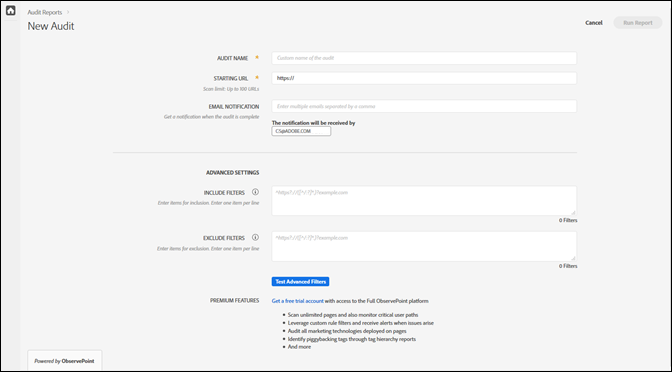

# Creazione di un nuovo controllo di audit {#create-a-new-audit}

>[!NOTE]
>
>Gli utenti possono eseguire un solo controllo di audit alla volta. Se si tenta di avviare un controllo di audit con le stesse impostazioni di quello in esecuzione, si verifica un errore. Puoi utilizzare il collegamento presente nel messaggio di errore se desideri annullare il controllo attualmente in esecuzione, in modo da poterne creare uno nuovo.

Se necessario, usa il collegamento nella parte inferiore della pagina per accedere a un account di prova gratuito e completo con ObservePoint.

1. Nell’elenco Auditor, fai clic su **[!UICONTROL New Audit]**.

   Viene visualizzata la schermata [!DNL New Audit].

   

1. (Obbligatorio) Denomina il controllo di audit.

   Il nome può essere lungo fino a 250 caratteri.
1. (Obbligatorio) Specifica l’URL iniziale.

   Il protocollo è richiesto quando si specifica l’URL iniziale. L’URL iniziale è la pagina in cui inizia la ricerca per indicizzazione del controllo di audit. Una volta avviato, Auditor esegue la ricerca per indicizzazione di fino a 500 pagine, seguendo i collegamenti che iniziano con l’URL iniziale. Per ulteriori informazioni, consulta [Include and Exclude Filters](../create-audit/filters.md) (Filtri Includi ed Escludi). L’URL iniziale può essere lungo fino a 250 caratteri.

   >[!NOTE]
   >
   >In alcuni casi, potrebbero essere necessarie fino a 48 ore per completare una scansione di 500 pagine.

1. Specifica uno o più indirizzi e-mail per le notifiche relative al controllo di audit.

   Puoi specificare più e-mail separando ogni indirizzo con una virgola. Il richiedente viene informato per impostazione predefinita. Gli indirizzi e-mail vengono convalidati in tempo reale. Se immetti un indirizzo non valido, le notifiche vengono visualizzate sullo schermo.

   Ogni e-mail non può contenere più di 250 caratteri, inclusa la fine del dominio (ad esempio, .com).
1. Specifica Include Filters.

   Questo campo può contenere URL esatti, URL parziali o espressioni regolari. Utilizza questo campo per i criteri a cui desideri che ogni URL corrisponda. Eventuali URL sottoposti a ricerca per indicizzazione che non corrispondono ai criteri di Include Filter non vengono inclusi nei risultati del controllo di audit.

   Puoi immettere le directory che desideri che vengano analizzate dal controllo di audit. In alternativa, puoi eseguire controlli su più domini o con autoreferenza, dove è necessario avviare il controllo di audit su un dominio e terminare su un altro. A tal fine, digita i domini che desideri analizzare; per i pattern URL complessi, utilizza un’espressione regolare.

   >[!NOTE]
   >
   >Se includi una pagina nei filtri, ma tale pagina non è connessa all’URL iniziale, oppure Auditor analizza 500 pagine prima di raggiungere tale pagina, la pagina non verrà analizzata e non verrà inclusa nei risultati del test.

   I filtri includono un massimo di 1.000 caratteri per riga.

   Per ulteriori informazioni, consulta [Include List](../create-audit/filters.md).
1. Specifica Exclude Filters.

   Exclude Filters impedisce che determinati URL siano sottoposti al controllo di audit. Utilizza URL esatti, URL parziali o espressioni regolari, esattamente come faresti nell’elenco Includi.

   Una pratica comune consiste nell’escludere un collegamento di logout se il controllo di audit include una sessione utente (ad esempio: `/logout`, ovvero qualsiasi URL contenente la stringa `/logout`).

   I filtri di esclusione sono limitati a 1.000 caratteri per riga.

   Per ulteriori informazioni, consulta [Exclude List](../create-audit/filters.md).
1. (Facoltativo) Se necessario, puoi verificare i filtri di inclusione ed esclusione e verificare gli URL.

   Immetti i filtri e gli URL, quindi fai clic su **[!UICONTROL Apply]** per eseguire il test.

   

1. Fai clic su **[!UICONTROL Run Report]**.
