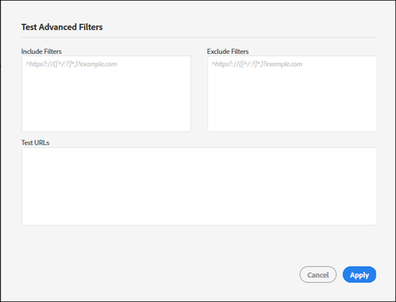

# Create a new audit{#create-a-new-audit}

>[!NOTE]
>
>Gli utenti possono eseguire un solo controllo alla volta. Si verifica un errore se si tenta di avviare un controllo con le stesse impostazioni di quello in esecuzione. È possibile utilizzare il collegamento presente nel messaggio di errore se si desidera annullare il controllo attualmente in esecuzione, in modo da poterne creare uno nuovo.

Se necessario, usate il collegamento nella parte inferiore della pagina per accedere a un account di prova gratuito e completo con ObservePoint.

1. Nell’elenco Auditor, fate clic su **[!UICONTROL Nuovo controllo]**.

   The [!DNL New Audit] screen opens.

   

1. (Obbligatorio) Denominate il controllo.

   Il nome può essere lungo fino a 250 caratteri.
1. (Obbligatorio) Specificate l’URL iniziale.

   Il protocollo è richiesto quando si specifica l&#39;URL iniziale. L’URL iniziale è la pagina in cui inizia la ricerca per indicizzazione del controllo. Una volta avviato, Auditor passa per il cursore fino a 500 pagine, dopo i collegamenti che iniziano con l’URL iniziale. Per ulteriori informazioni, consulta [Includi ed Escludi filtri](../create-audit/filters.md#concept-23531490bb124981ba807ed1806e3257) . L&#39;URL iniziale può contenere fino a 250 caratteri.

   >[!NOTE]
   >
   >In alcuni casi, potrebbero essere necessarie fino a 48 ore per completare una scansione di 500 pagine.

1. Specificare uno o più indirizzi e-mail per le notifiche sul controllo.

   Potete specificare più e-mail separando ogni indirizzo con una virgola. Il richiedente viene informato per impostazione predefinita. Gli indirizzi e-mail vengono convalidati in tempo reale. Se immettete un indirizzo non valido, le notifiche vengono visualizzate sullo schermo.

   Ogni e-mail non può contenere più di 250 caratteri, inclusa la fine del dominio (ad esempio, .com).
1. Specificate Includi filtri.

   Questo campo può contenere URL esatti, URL parziali o espressioni regolari. Utilizzate questo campo per i criteri per i quali desiderate che ogni URL corrisponda. Eventuali URL sottoposti a ricerca per indicizzazione che non corrispondono ai criteri Includi filtro non vengono inclusi nei risultati del controllo.

   È possibile immettere le directory che si desidera che vengano analizzate dal controllo. In alternativa, è possibile eseguire controlli su più domini o con autoreferenza, dove è necessario avviare il controllo su un dominio e terminare su un altro. A tal fine, digitare i domini che si desidera attraversare; per i pattern URL complessi, utilizzate un&#39;espressione regolare.

   >[!NOTE]
   >
   >Se includete una pagina nei filtri, ma non è connessa all’URL iniziale, oppure Auditor analizza 500 pagine prima di raggiungere tale pagina, la pagina non verrà analizzata e non verrà inclusa nei risultati del test.

   I filtri includono un massimo di 1.000 caratteri per riga.

   Per ulteriori informazioni, consulta [Includi elenco](../create-audit/filters.md#section-7626060a56a24b658f8c05f031ac3f5f) .
1. Specificate Escludi filtri.

   L’elenco Escludi impedisce l’audit degli URL. Utilizzate URL esatti, URL parziali o espressioni regolari, esattamente come fareste nell’elenco Includi.

   Una pratica comune consiste nell’escludere un collegamento di logout se il controllo include una sessione utente (ad esempio: `/logout`, ovvero qualsiasi URL contenente la stringa `/logout`).

   I filtri di esclusione sono limitati a 1.000 caratteri per riga.

   Per ulteriori informazioni, consulta [Escludi elenco](../create-audit/filters.md#section-00aa5e10c878473b91ba0844bebe7ca9) .
1. (Facoltativo) Se necessario, potete verificare i filtri include ed esclude e verificare gli URL.

   Immettete i filtri e gli URL, quindi fate clic su **[!UICONTROL Applica]** per eseguire il test.

   

1. Fai clic su **[!UICONTROL Esegui rapporto]**.
