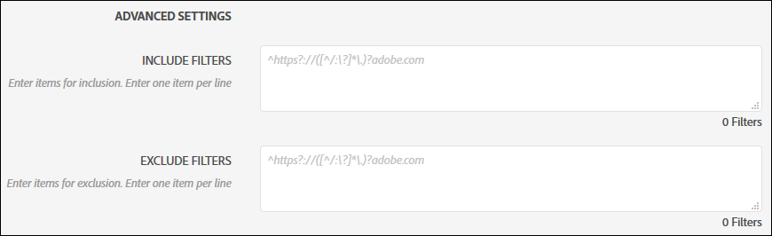
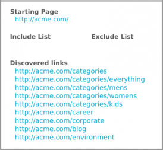
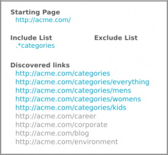
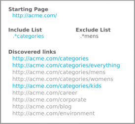
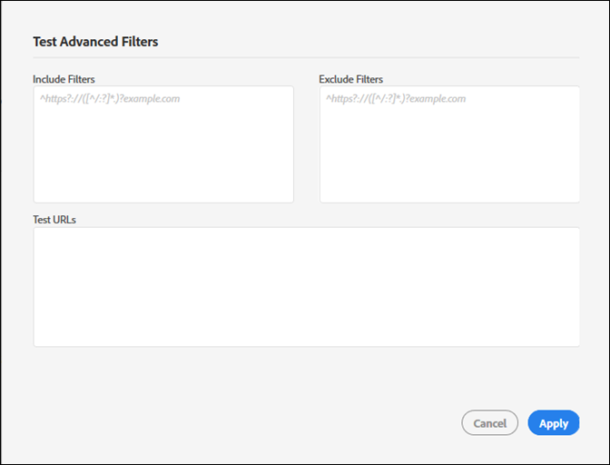

# Filtri di inclusione e filtri di esclusione {#include-and-exclude-filters}

I filtri di inclusione limitano i collegamenti di cui un controllo di audit può eseguire il crawling a partire dall’URL iniziale. I filtri di esclusione impediscono a un controllo di audit di eseguire il crawling dei collegamenti.

<!--
Content from ObservePoint (https://help.observepoint.com/articles/2872121-include-and-exclude-filters) with their permission. Modified slightly for style and Auditor emphasis.
-->

I filtri di inclusione e i filtri di esclusione forniscono linee guida per i controlli di audit. Lasciando vuoti i filtri di inclusione e i filtri di esclusione, un controllo di audit può eseguire il crawling di qualsiasi collegamento in cui si imbatte, a partire dai collegamenti nell’URL iniziale.



Applicando filtri di inclusione, filtri di esclusione o una combinazione di entrambi, è possibile specificare su quali collegamenti il controllo di audit può eseguire il crawling.

Qualsiasi elemento nel campo Include Filters limita la scansione solo alle pagine che corrispondono a tale elemento. Qualsiasi elemento in un campo Exclude Filters impedisce la scansione delle pagine che corrispondono a tale elemento.

I filtri di inclusione e i filtri di esclusione possono essere URL completi, URL parziali o espressioni regolari che corrispondono a una pagina valida.

## Ordine di precedenza {#section-e9d42419dd3f459bb20e7a33c6104f12}

1. L’**URL iniziale** ha la precedenza su tutto il resto e sarà sempre visitato durante un controllo di audit, anche se un URL corrisponde a un elemento in Exclude Filters. L’URL iniziale viene sempre visitato prima di qualsiasi altro URL.

   

   Nell’immagine qui sopra, un controllo di audit rileva i collegamenti dalla proprietà `document.links` della pagina iniziale. Tali collegamenti possono essere analizzati dal controllo di audit.

1. Gli **URL inclusi** devono essere collegati da una pagina iniziale, altrimenti non possono essere scoperti e non verranno visitati.

   

   Nell’immagine precedente, l’aggiunta di un filtro di inclusione limita gli URL idonei a quelli corrispondenti al filtro. Ora solo cinque collegamenti possono essere analizzati dal controllo dell’audit.

1. Gli **URL esclusi** eliminano i collegamenti dall’idoneità.

   

   Nell’immagine precedente, l’aggiunta di un filtro di esclusione impedisce agli URL di accedere ai collegamenti idonei. Ora solo tre collegamenti possono essere analizzati dal controllo dell’audit.

## URL iniziale {#section-ccb46abcd96f4a8ab171245015d2b724}

Auditor richiede una singola pagina per l’URL iniziale. L’URL iniziale viene sempre visitato prima di qualsiasi altro URL. Eventuali collegamenti scoperti dalla pagina iniziale possono essere visitati, fatti salvi i filtri di inclusione e i filtri di esclusione. Se un elemento in Exclude Filters corrisponde a un URL iniziale, verrà ignorato.

## Filtri di inclusione {#section-7626060a56a24b658f8c05f031ac3f5f}

I filtri di inclusione limitano i collegamenti idonei per la scansione durante un controllo di audit. I filtri di inclusione possono essere:

* URL completamente qualificati
* URL parziale
* Espressioni regolari corrispondenti agli URL completi o parziali
* Qualsiasi combinazione di quanto sopra

L’aggiunta di URL o espressioni regolari ai filtri di inclusione non garantisce che tali URL specifici vengano analizzati nel controllo di audit. Il controllo di audit esamina i collegamenti nell’URL iniziale, quindi esplora i collegamenti idonei. Il controllo di audit prosegue questo processo di ispezione e navigazione fino al raggiungimento del limite di 500 URL scansionati o fino al raggiungimento di nessun altro collegamento idoneo.

>[!NOTE]
>
>In alcuni casi, potrebbero essere necessarie fino a 48 ore per completare una scansione di 500 pagine.

Per impostazione predefinita, un controllo di audit eseguirà la scansione di tutti i sottodomini dell’URL iniziale. A meno che non venga esplicitamente ignorato fornendo un filtro di inclusione, la scansione utilizzerà il filtro di inclusione regex seguente:

`^https?://([^/:\?]*\.)?mysite.com`

In questo modo, qualsiasi collegamento presente nella pagina dell’URL iniziale può essere visitato. Corrisponde a qualsiasi pagina in qualsiasi sottodominio dall’URL iniziale.

L’utilizzo del filtro di inclusione predefinito offre un ampio intervallo di crawling per un controllo di audit. Per eseguire il controllo di audit in alcune sezioni o pagine, fornisci indicazioni specifiche aggiungendo filtri in questa casella. In tal caso, sostituisci il valore predefinito con le directory che desideri che vengano analizzate dal controllo di audit. È inoltre possibile utilizzare i filtri di inclusione per eseguire il controllo tra più domini in cui è necessario avviare il controllo di audit su un dominio e terminarlo su un altro. A tal fine, digita i domini che desideri sottoporre al controllo. In ogni caso, per trovare eventuali URL inclusi nel filtro, questi devono essere rilevati in una pagina sottoposta a controllo.

I filtri di inclusione possono contenere URL esatti, URL parziali o espressioni regolari. Ad esempio, se l’URL iniziale è [!DNL http://mysite.com], le pagine successive potrebbero essere sottoposte a scansione per impostazione predefinita (nota i caratteri in grassetto):

```html
http://mysite.com
http
<b>s</b>://mysite.com
http://
<b>www</b>.mysite.com/home
http://
<b>dev</b>.mysite.com/home
http://
<b>my</b>.mysite.com/products/products_and_services.html
```

Per i pattern URL complessi, utilizza il [tester delle espressioni regolari di ObservePoint](https://regex.observepoint.com/).

## I filtri di esclusione {#section-00aa5e10c878473b91ba0844bebe7ca9}

I filtri di esclusione impediscono che determinati URL siano sottoposti al controllo di audit. Puoi usare URL esatti, URL parziali o espressioni regolari. Eventuali URL che corrispondono a un elemento presente nei filtri di esclusione non vengono visitati. Se l’URL iniziale è incluso nei filtri di esclusione, non viene escluso. L’URL iniziale viene sempre analizzato da un controllo di audit.

## Verifica di filtri e URL {#section-3cfa125b1756411395a64701e128efa0}

Puoi verificare i filtri e gli URL in Auditor.

Durante la creazione del controllo di audit, fai clic su **[!UICONTROL Test Advanced Filters]**. Inserisci i filtri e gli URL, quindi fai clic su **[!UICONTROL Apply]**.



## Documentazione di ObservePoint {#section-79cdc8e850d047969b6d2badf6bbd6f9}

Questo articolo è stato sviluppato in collaborazione con ObservePoint. Per informazioni aggiornate, consulta la [documentazione di ObservePoint](https://help.observepoint.com/).
