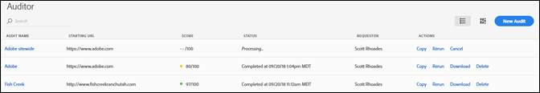
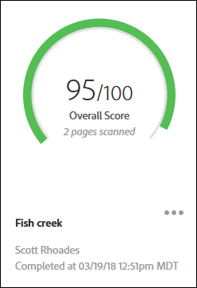
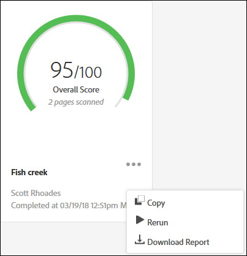

# Pagina Audit List{#audit-list-page}

La pagina Audit List mostra informazioni su tutti i controlli di audit.

Quando avvii Adobe Experience Platform Auditor, viene visualizzata la pagina Audit List (Elenco dei controlli di audit). Puoi visualizzare la pagina Audit List come vista a elenco o schede.

## Vista a elenco {#section-a428749d2ab94a08bf460e6a486b844a}

Nella vista a elenco sono visualizzate le seguenti informazioni per ciascuno dei controlli di audit.

| Elemento | Descrizione |
|---|---|
| Nome del controllo di audit | Nome assegnato all’audit |
| URL iniziale | L’URL da cui si inizia a esaminare le pagine |
| Punteggio | I controlli di audit vengono valutati da 1 a 100; un punteggio di 100 che indica che non ci sono problemi nelle pagine digitalizzate. |
| Stato | Indica quando il controllo di audit è stato completato o che è in corso di elaborazione. |
| Richiedente | Mostra il nome dell’utente che ha creato il controllo di audit. |
| Azioni | Fornisce collegamenti per copiare o ripetere il controllo di audit, annullare un controllo attualmente in esecuzione, scaricare un rapporto come foglio di calcolo [!DNL Excel] o eliminare il controllo di audit. |

Fai clic sul nome del controllo di audit per visualizzare i risultati del controllo.

## Vista a schede {#section-6826b585e53a46daa722b9bd3eda926e}

La vista a schede mostra ciascun controllo di audit in un formato grafico.

Fai clic sul nome del controllo di audit per visualizzare i risultati del controllo. Fai clic sul menu accanto al nome per visualizzare i collegamenti che consentono di copiare, ripetere o annullare il controllo di audit, oppure per scaricare un rapporto finito come foglio di calcolo [!DNL Excel] o PDF:

