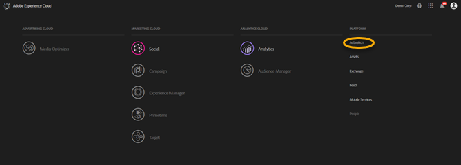
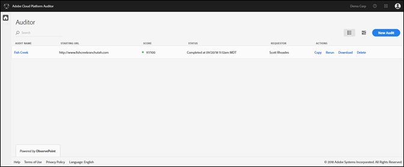
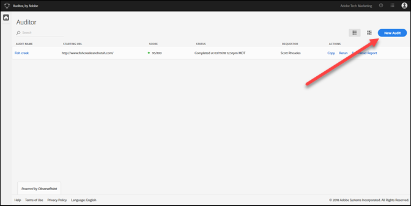
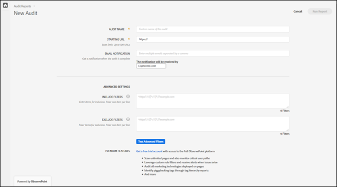
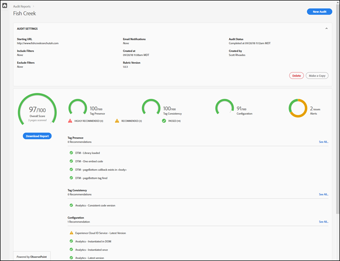

# Introduzione{#getting-started}

## Guida introduttiva {#task-1024e94b5948413295c9698e62165a04}

<!--
This page is a placeholder for now, we need things like prerequisites, any planning that should be done before using Auditor, initial setup info--that kind of thing.
-->

La prima volta che utilizzate Auditor, dovete completare e accettare l&#39;accordo di Auditor. Auditor è stato sviluppato come uno sforzo collaborativo tra Adobe e ObservePoint. Gli utenti di Auditor possono utilizzare funzionalità ObservePoint limitate senza costi aggiuntivi. Per utilizzare Auditor, dovete acconsentire alle comunicazioni da ObservePoint.

## Esecuzione della prima scansione {#task-b211597afed343cfa238443fcf7c6041}

1. Fai clic sul pulsante del menu nell&#39;angolo superiore destro della barra di navigazione di Adobe Experience Cloud e fai clic su **[!UICONTROL Attivazione]**.

   

1. Selezionate Auditor e accettate le Condizioni d&#39;uso.

   La pagina Auditor offre una dashboard delle scansioni precedenti, con l’opzione di eseguire una nuova scansione.

   

1. Fare clic su **[!UICONTROL Nuovo controllo]**.

   Per eseguire una nuova scansione, fare clic su **[!UICONTROL Nuovo controllo]** nell&#39;angolo in alto a destra della schermata.

   

1. Configurare la scansione.

   Assegna un nome al controllo di audit, fornisci un URL iniziale e fai clic su **[!UICONTROL Esegui rapporto]**. Al termine dell’analisi riceverai una notifica e-mail.

   

   Per una descrizione di tutte le opzioni di configurazione, vedere [Creazione di un nuovo controllo](../create-audit/create-new-audit.md#task-6d157f80e5264642b877c2820b1d077d).
1. Visualizza il rapporto.

   Quando ricevi l’e-mail che ti fa sapere che la scansione è completa, fai clic sul collegamento per [visualizzare il rapporto](../reports/scorecard.md#concept-8958a64346c34f74844553dda1ccf869) e iniziare a comprendere le opportunità per migliorare la tua implementazione e ottenere più valore dalle soluzioni Adobe.

   È inoltre possibile fare clic sul nome del controllo nella pagina  Auditor per visualizzare lo stato del controllo e il rapporto al termine del controllo.

   
