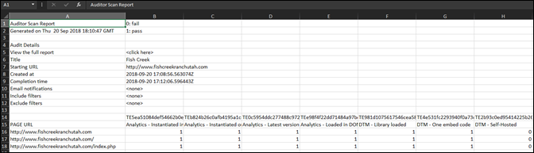

# Download del rapporto {#download-report}

Il rapporto mostra se ciascun URL è approvato o non approvato.

Il rapporto può essere visualizzato nella pagina Scheda di valutazione nell’interfaccia utente. Puoi scaricare il rapporto anche:

1. Nell’elenco Auditor o in una scheda di valutazione, fai clic su **[!UICONTROL Scarica rapporto]**.

   Puoi scaricare il rapporto come un foglio di calcolo o un file PDF.
1. Specifica se aprire o salvare il file.

1. Fai clic su **[!UICONTROL OK]**.

   Il foglio di calcolo mostra se ogni test è stato superato o meno su ciascuna pagina.

   

Il PDF mostra le informazioni seguenti:

* Impostazioni per il controllo di audit
* Timestamp completamento
* Punteggio complessivo
* Punteggio per categoria
* Test di unità applicati con URL con errore
* Collegamento a raccomandazioni e documentazione di aiuto per test
