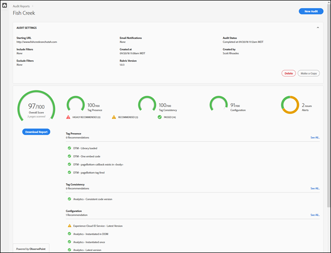
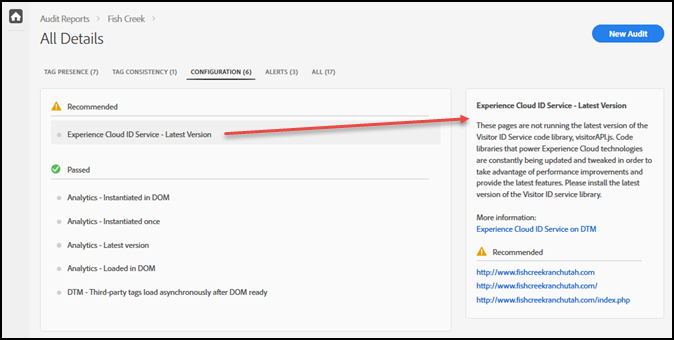

# Scorecard{#scorecard}

Dopo aver eseguito un test, la scorecard mostra le informazioni su un controllo.

Fate clic sul nome del controllo nella pagina Auditor per visualizzare i risultati del test.

Utilizzare la scorecard per visualizzare il punteggio del controllo nelle seguenti categorie:

* Valutazione complessiva
* Presenza di tag

   Valuta se il tag esiste e se si trova nella posizione giusta nel codice della pagina.
* Uniformità tag

   Valuta se i tag sono coerenti tra gli URL.
* Configurazione

   Valuta i tag rispetto ad altre regole e procedure ottimali consigliate.
* Avviso

   Gli avvisi mostrano problemi di cui dovreste essere a conoscenza, ma che non influiscono sulla valutazione.

Il punteggio dipende dal peso di ciascun test e dal superamento o meno. Se passate, la valutazione aumenta di un numero di punti pari allo spessore del test.

* 0: Avvisi di problemi di cui dovresti essere a conoscenza, ma che non influiscono sulla valutazione.
* 1: Consiglia un&#39;ottimizzazione. Nessun impatto sulla precisione dei dati.
* 2: Se il test non viene superato, non potrai accedere alle funzioni e alle correzioni più recenti in Adobe Experience Cloud.
* 3: Test di efficienza e verifica se l’implementazione rispetta le best practice altamente raccomandate.
* 4: In caso di errore, è possibile che si raccolgano dati non affidabili.
* 5: Se si verifica un errore, è possibile che si verifichi una perdita di dati.

La scorecard elenca tutti i problemi di livello 4 o 5 **altamente raccomandati** che si risolve.

La scorecard elenca eventuali problemi di livello da 1 a 3 come **consigliato** .

Fai clic su **[!UICONTROL Scarica il rapporto]** per scaricare un file Excel o PDF contenente le informazioni segnalate dal controllo di audit.

Oltre alla valutazione per ciascuna categoria, la scorecard elenca tutte le correzioni consigliate o altamente raccomandate, nonché gli elementi che hanno superato il test. Fate clic su ogni edizione per visualizzare ulteriori dettagli nella casella a destra. Fate di nuovo clic per approfondire e visualizzare le raccomandazioni su come risolvere il problema. Di seguito sono riportati i dettagli di un problema consigliato nella scorecard mostrata sopra:

Fate clic sulle categorie nella parte superiore dello schermo per visualizzare i problemi rilevati in ciascuna categoria.

## Quali pagine facevano parte del test? {#section-fd38ffeb868648e89c34c5772fa65f46}

È possibile visualizzare gli elenchi degli URL che hanno superato o superato il test.

Dalla scorecard, fare clic sul nome di un test o sul collegamento **[!UICONTROL Vedi tutto]** sotto ogni intestazione di categoria. Questo porta ai dettagli dei test. Per ogni test, potete visualizzare la descrizione del test e un elenco degli URL che hanno avuto esito negativo e che sono stati superati. Queste informazioni sono incluse anche nei rapporti scaricati.
